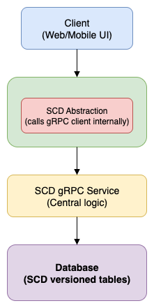

# SCD Service

A gRPC-based microservice for managing Slowly Changing Dimensions (SCD) using versioned data models.  
This service supports Job, Timelog, and PaymentLineItem entities with version history, immutability, and centralized update/query logic.

## Motivation

In distributed systems, it's critical to preserve historical versions of entities while enabling efficient access to the most recent one. This pattern, known as Slowly Changing Dimensions (SCD), enables:

- Auditability and rollback
- Temporal analytics
- Immutable data history
- Safe concurrent updates

This service implements **SCD Type 2** using versioned rows, allowing consumers to retrieve the latest versions and make updates without losing historical context.

## Benefits

* Avoid code duplication:
 

* Easier maintenance and feature updates:
 

* Consistent SCD handling:
 

* Performance optimizations:
 

* Language agnostic access:
 

## Technologies Used

- Language: Go
- Framework: gRPC + Protobuf
- ORM: GORM (SQLite)
- Client Support: Go, Python (via gRPC stubs)

## System Design Overview
Each entity has a logical ID (shared across versions) and a unique UID (per version).

The latest version is determined by the highest version number per UID.

Updates are append-only operations that preserve history.

Clients can query the latest version via dedicated APIs like GetLatestJobs.



### Design Decisions

#### Centralized SCD Logic
All versioning and querying logic is centralized in this Go service, avoiding duplication across consumers (e.g., Django, other Go microservices).

####  Generic Latest-Version Query Abstraction
A shared helper builds GORM queries to fetch the latest version of any model using subqueries and joins, e.g.:

```bash
func GetLatestVersionQuery(db *gorm.DB, model interface{}, idColumn string) *gorm.DB
```

####  Standardized schema and cross-language support (e.g., Python client) via generated stubs.

####  Explicit Version Incrementation
Update operations read the latest version, increment the version, and insert a new row—ensuring no version conflicts or data loss.


## Getting Started

### 1. Clone the Repository

```bash
git clone https://github.com/your-org/scd-service.git
cd scd-service
```

### 2. Run the Service
```bash
go run main.go
```
### 3. Run Tests
```bash
go test ./...
```
### 4. Generate gRPC Code (Optional)
```bash
protoc --go_out=. --go-grpc_out=. proto/scd.proto
```
### 5. Generate gRPC Stubs for Python Clients
```bash
python3 -m grpc_tools.protoc -I=proto --python_out=client/python --grpc_python_out=client/python proto/scd.proto
```

## Sample gRPC APIs
```bash
UpdateJob("uid1", map[string]string{
  "status": "in-progress",
  "title":  "Backend Developer",
  "rate":   "25.5",
})
```
```bash
UpdateTimelog("tl_uid_2", map[string]string{
  "duration": "1800",
  "type":     "adjusted",
})
```
```bash
GetLatestJobs("in-progress")
```

```bash
GetLatestTimelogs("adjusted")
```

## Alternatives Considered
### Database Views for Latest Versions:
We considered DB views that materialize only the latest versions using MAX(version) and group-by-UID logic. While this simplifies client access, it:

* Adds DB schema complexity

* Makes version-based filters harder to express

* Reduces flexibility in applying business rules before returning results

* We chose the service-based approach to retain flexibility, testability,and centralized control.


### Future Improvements
* Add caching layer for frequently requested latest entities

* Add pagination and filtering to list APIs

* Support soft deletion and archival

* Add metrics and monitoring